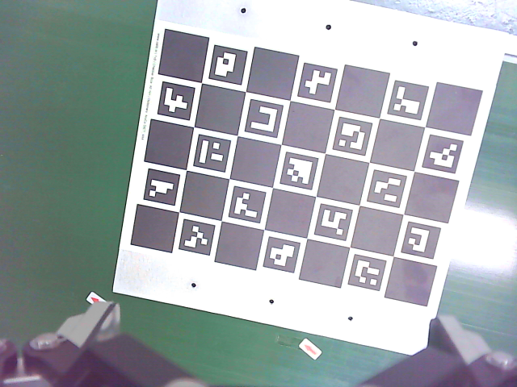
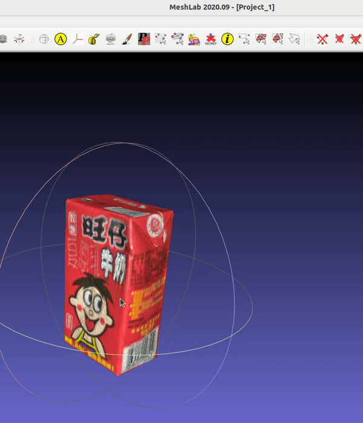
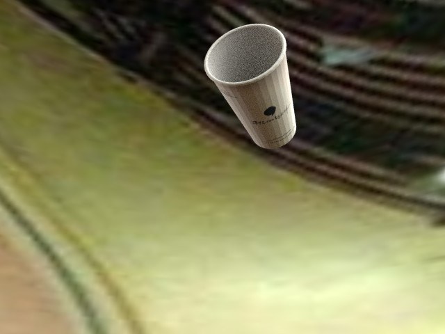
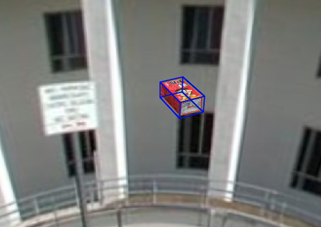
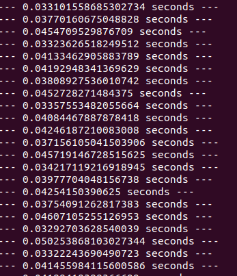

# demo_6D_pose_yuil_robot

| task    | detail |
| -------- | ------- |
| python demo  |   ubuntu 22, yuil lib  |
| camera seting and calibration  |   to get parameters  |
| 6D pose estimation of object  |  to get 6D pose of a object   |
| grasping with moving object  |  to grasp a moving object in the conveyor belt |

# python code for Yuil robot

Based on [this lib](https://openroboticsalliance.com/en/pc/download), python code can be used for Yuil robot like blew.
```
from yuil_lib import Yuil_robot

real_robot = Yuil_robot()
pos = [0.551, 0.383, 0.277,-3.14, 0.0, 1.56]
real_robot.gripper_close()
real_robot.gripper_open()
real_robot.xyz_move(pos,90)
```

# camera seting and calibration

```
sudo v4l2-ctl --device=0 --list-ctrls
sudo v4l2-ctl --device=0 --set-ctrl=focus_automatic_continuous=0
sudo v4l2-ctl --device=0 --set-ctrl=focus_absolute=10
sudo v4l2-ctl --device=0 --set-ctrl=brightness=-50
sudo v4l2-ctl --device=0 --set-ctrl=white_balance_automatic=0
sudo v4l2-ctl --device=0 --set-ctrl=white_balance_temperature=6000
python cam_cal.py
```


# 6D pose estimation of object

```
# Prepare for demo code
# Download demo code and run.
git clone https://github.com/zhaoruinan/demo_6D_pose_yuil_robot.git
cd demo_6D_pose_yuil_robot
```
Download  trained [model](https://hanyangackr0-my.sharepoint.com/:u:/g/personal/zhaoruinan_m365_hanyang_ac_kr/EWVFXd-XFYNOqhVaWqnsNAUB1Zu9GLUgmWWPTnCrlTbTiA?e=WQXyMC) for 6D pose estimation 
put it in data/model/pvnet/custom/
``` 
# get the latest image for pvnet docker env
docker pull ruinanzhao/pvnet-clean:latest

sudo vim ~/.bashrc

# add this lines,use "i" to edit
export PVNET_DOCKER=ruinanzhao/pvnet-clean:latest
export PVNET_GIT=$HOME/demo_6D_pose_yuil_robot  # update this with the directory of demo code
source $PVNET_GIT/docker/setup_dev.bash

# use ":wq" to save and exit
source ~/.bashrc

pvnet_docker # By this, a docker env will be run for demo code.

# inside the docker container
conda activate pvnet
cd demo_6D_pose_yuil_robot 
python run.py --type online2 --cfg_file configs/custom.yaml

```

rebuild docker image
```
cd docker
docker build . -t  ruinanzhao/pvnet-clean:latest
```
make sure the 3D model of an object  


generate dataset of object   

```
# dataset directory

git clone https://github.com/DLR-RM/BlenderProc
cd BlenderProc/
pip install blenderproc
blenderproc download cc_textures resources/cctextures

cp $HOME/demo_6D_pose_yuil_robot/bop_object_pose_sampling.py examples/datasets/bop_object_pose_sampling/main.py
cp $HOME/demo_6D_pose_yuil_robot/milk_dataset.sh ./
sudo chmod +x milk_dataset.sh
./milk_dataset.sh
```
Training on the custom object for yolov5   


Training on the custom object
```
#1. Process the dataset:
python run.py --type custom

#2. Train:
python run.py --cfg_file configs/custom.yaml

#3. Test trained pvnet model:
python run.py --type evaluate --cfg_file configs/custom.yaml

#output:
#2d projections metric: 1.0
#ADD metric: 0.3586
#5 cm 5 degree metric: 1.0
#mask ap70: 1.0
```

  
Test trained pvnet model with a video:
```
python run.py --type online3 --cfg_file configs/custom.yaml
```

  

Loop cost time   
    

run after segment with yolov5
```
python run.py --type online2 --cfg_file configs/custom.yaml
```
   

# grasping with moving object 

```
python main.py
```
open anther terminal
```
pvnet_docker
# inside the docker container
conda activate pvnet
cd demo_6D_pose_yuil_robot 
python run.py --type online4 --cfg_file configs/custom.yaml

```  
 

