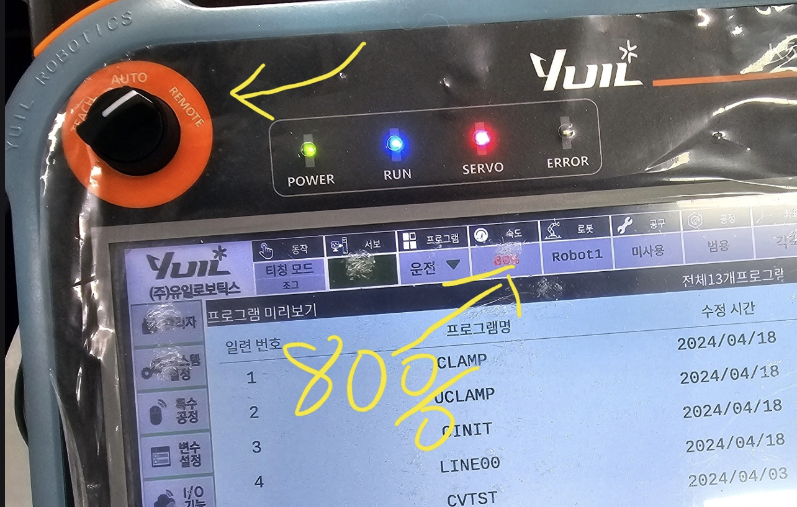

# demo_6D_pose_yuil_robot

| task    | detail |
| -------- | ------- |
| python code for Yuil robot  |   ubuntu 22, yuil lib  |
| grasping cup  |   grasp a moving cup in the conveyor belt   |

# python code for Yuil robot

Based on [this lib](https://openroboticsalliance.com/en/pc/download), python code can be used for Yuil robot like blew.
```
from yuil_lib import Yuil_robot

real_robot = Yuil_robot()
pos = [0.551, 0.383, 0.277,-3.14, 0.0, 1.56]
real_robot.gripper_close()
real_robot.gripper_open()
real_robot.xyz_move(pos,90)
```
  

# grasping cup

robot setting: 

1. turn on robot server to "대기" status
2. change speed to 80%
3. change mode to remote  



3. Download the model and put it in "./data/model/pvnet/cup":
https://drive.google.com/file/d/1hV7gYzG4YwH2zRXlrlx7sC53Mx3fGTY1/view?usp=drive_link
4. open terminal in ubuntu system, input as:
```
python yuil_pvnet_yolo.py
```

# Train a 6D pose estimation model

how to train a 6D pose estimation model
https://github.com/zju3dv/clean-pvnet

make sure the 3D model of an object  


generate dataset of object  (code:
https://github.com/zju3dv/pvnet-rendering) 


